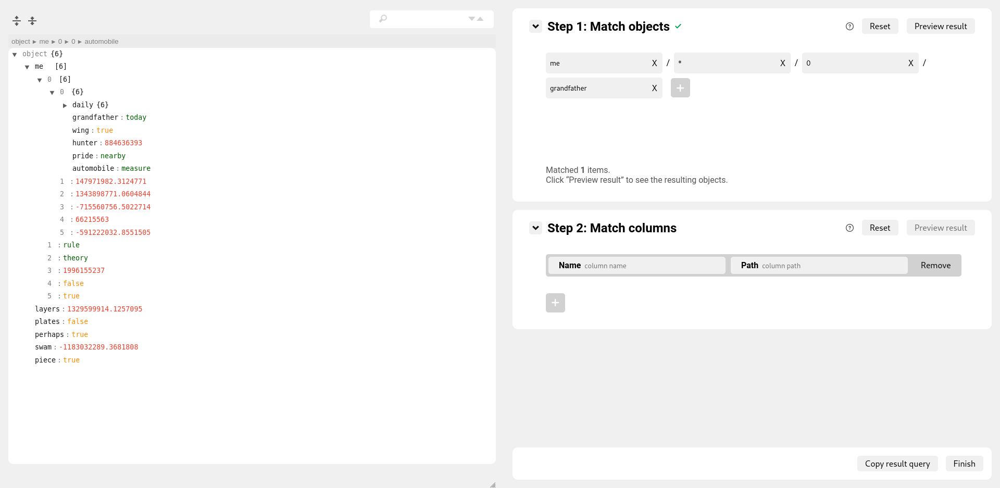

# JSON to Extraction Query

 GUI that translates manual user selections on an imported JSON file into *extraction query*. Extraction query is a hybrid of [JSON Path](https://goessner.net/articles/JsonPath) syntax and can be utilized by further services to create a table of extracted values. The component becomes useful once it is required to extract data subset of the particular JSON and define relations within the extraction. 

 - Utilizes [jsoneditor](https://github.com/josdejong/jsoneditor) to visualize the imported JSON.
 - Inspired by [IMPORTJSONAPI](https://github.com/qeet/IMPORTJSONAPI).

## Extraction query

The extraction query is a result of running the program. You can pass your own `onFinish` function that accepts a single value of `OutputQuery` type (details below).
### Schema

The output of running the program is an object (dictionary) of the following type:

```
type OutputQuery = {
    path: string;
    columnNames: string[];
    columnPaths: string[]
}
```

### Semantics

- `path` stands for the JSONPath expression that is executed to extract the data from the initial JSON. [Learn more](https://github.com/qeet/IMPORTJSONAPI#jsonpath-query).
- `columnNames` is a list of columns' names. The size of that list is the same as the length of `columnPaths`. [Learn more](https://github.com/qeet/IMPORTJSONAPI#columns).
- `columnPaths` is a list of columns' JSONPath-like paths.

## How to import as a component

TBA 

## How to run locally

1. Clone this repository.
2. In the cloned folder run:

```
npm install
npm run start
```

3. Edit `public/data.json` that will be used in the application.



## TODOs

- Create a Dockerfile to run the application in a container.
- Cover with unit test suite.
- Let users import JSON from local using GUI.
- Better integration with the JSON browser (highlight selections, filter, search).